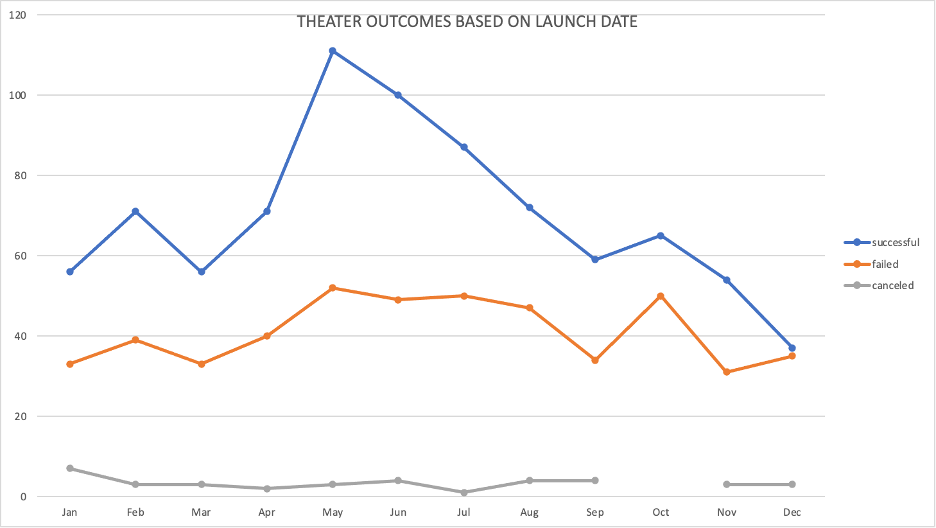
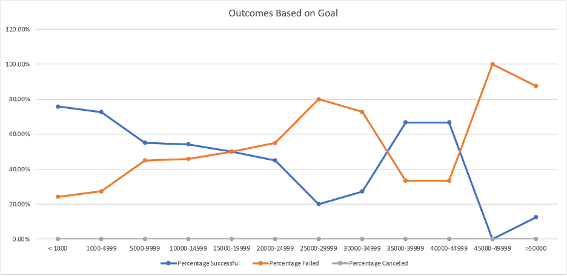

# 1Kickstarter-Analysis
# Overview of Project

## Purpose

The overall purpose of this analysis is to get acquainted as possible with Excel so that I 
could move on to learning Visual Basic without any significant issues. This lesson also 
taught me that there are infinite ways to look at data and that it’s not just a bunch of 
random numbers. Data is so dynamic and powerful that it’s almost as if it were a living, 
breathing life form. We were able to learn all these things through a lot of practice with 
Excels tools such as Excel formulas, charts, pivots tables, and other various techniques. 
I believe that this lesson completely served it purpose and then some. I’m very confident 
in moving on to learning Visual Basic and that would’ve been near impossible without 
me going through this Excel crash course.

## Background

I was given the task helping Louise with her research in preparation for a kick starter 
campaign so that she could fund her up and coming playwright. I was able to do this by 
organizing, sorting, and analyzing the data presented so that I could determine if there
were any specific factors or trends that made a kick starter campaign successful.

# Analysis and Challenges

## Analysis

In order to give Louise as much help as I possibly could, I first had to get familiar with 
the data by looking it over, making sure that I knew all the headers and how many rows 
I was working with, filter certain data and add conditions so that it was relevant to 
Louise, and more things of that nature. After that, I used pivot tables and charts, 
vlookups, and countif statements to isolate data so that the data was more readable and 
easier to explain to someone like Louise who isn’t extremely familiar with the inner 
workings of Excel.

## Challenges

The areas of this module challenge that gave me the most issues were vlookups and 
making sure that my countif statements were correct. While completing section 1.4.2 of 
the module it was very confusing to me that the column index number in the equation 
was one off from the sheet column index number and after just staring at the screen and 
plugging in random numbers for about 30 minutes I went to YouTube and watched a 
few videos on vlookups and realized that column index number wasn’t based on the 
sheet’s column index but rather the table array that I was applying the vlookup 
statement to. In this case, the table array started with column B meaning that column B 
was column index number 1.

When I was completing the “Outcomes Based on Goals” sheet in the second part of the 
module challenge  I watched the hint video describing how to use countif statements 
and actually found the countif statements very simple and fun to work with but while 
watching the video I noticed that at the end of the video the instructor used two extra 
statements: 1 to calculate the total number of US rock campaigns by adding the 
numbers in the column and 2 to add all of the US rock campaigns from the original 
sheet using a countif statement to make sure that the numbers matched and that he 
was pulling the data correctly. When I did this myself my numbers weren’t matching, 
and it was giving a huge headache because everything looked correct. I was then 
worried that if everything looked correct then it meant something might be wrong with 
my original data set and if that were the case, I could have a lot of mistakes in all of my 
course work that I never realized. After taking a deep breath, I realized that my first 
mistake was that the dataset I was using wasn’t accounting for all of the outcomes by 
excluding the “live” outcome. After realizing that I filtered for all of the “live” plays so that 
I could account for them, but my numbers still weren’t adding up. My final mistake was 
that I was referencing the wrong cell in my addition equation, and it took me about 20 
stressful minutes to realize this. These mistakes may seem very little, but I chose to 
write about them because of how close I was to panicking and going back through all 
my work and possibly making unnecessary changes which would have then made my 
original dataset incorrect and sent me into a tailspin. This mistake truly taught me that 
when I’m stressed, I need to take a deep breath, maybe walk away for 10-15 minutes, 
and come back with a fresh set of eyes.

# Results

## Theater Outcomes Based on Launch Date Conclusions

The two biggest conclusions that I drew from the “Theater Outcomes Based on Launch 
Date” analysis were that from 2009-2017, almost double the amount of theater 
campaigns were successful compared to the ones that failed and that Louise had the 
highest chance of having a successful campaign between April and July with May 
having the most chance for success. It was also interesting to me that even though 
there were so many more successful theater campaigns than failed theater campaigns, 
by the time December rolled around the number of successful and failed campaigns 
was within 3.

## Outcomes Based on Goals Conclusions

The main takeaway I had from the “Outcomes Based on Goals” analysis was that, 
according to the data, Louise’s goal barely had above a 50% chance of succeeding. 
This isn’t completely a bad thing because I believe that 50% is still a big number but if 
she were to lower her goal to under $5,000, she would have a much better chance to 
succeed but asking the client to decrease their budget by 50% is outrageous. Another 
piece of data that caught my eye was that if she were to up her goal to $35,000-$50,000 
she would technically have a higher chance of succeeding than with goal she has now, 
but that goal range has very small sample size therefore I feel that that information 
could be slightly misleading nonetheless it’s still a true statement.

## Limitation

The most glaring limitation of this data set in my opinion was the fact that there was no 
social media or internet data in it. I feel that that kind of data could be very useful to 
Louise because in today’s day and age the internet is used in just about everything and 
where these kick starter campaigns were being posted in order to succeed or fail could 
help Louise a lot more. I could’ve given Louise the best advice/predictions possible with 
the given data set but that could all be destroyed if she were to put her campaign on a 
website that had a high rate of failure relative to kick starter campaigns. I would have 
liked to give Louise a line graph containing the websites most used and the outcomes. 
That would be very pertinent information. Another graph I would’ve liked to present 
Louise with, is one that contained the length of the campaign and the outcomes.
